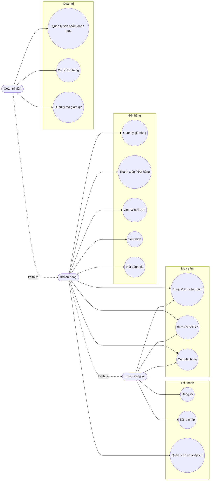

# 02 — Use Case

## 2.1 Sơ đồ Use Case

## 2.2 Đặc tả các use case chính

### UC-05 — Đăng nhập
| | |
|---|---|
| **Tác nhân** | Khách vãng lai |
| **Tiền điều kiện** | Đã có tài khoản |
| **Luồng chính** | 1. Nhập email + mật khẩu. 2. Hệ thống kiểm tra thông tin. 3. Trả về access token + refresh token + hồ sơ. 4. Client lưu token, chuyển hướng. |
| **Ngoại lệ** | Sai email/mật khẩu → báo lỗi 401; tài khoản bị khoá → từ chối. |
| **Hậu điều kiện** | Người dùng ở trạng thái đăng nhập. |

### UC-01 — Duyệt & tìm sản phẩm
| | |
|---|---|
| **Tác nhân** | Guest / Khách hàng |
| **Luồng chính** | 1. Mở trang sản phẩm. 2. Chọn danh mục / nhập từ khoá / đặt khoảng giá / chọn size, màu. 3. Chọn cách sắp xếp. 4. Hệ thống trả danh sách phân trang (cache Redis). |
| **Mở rộng** | Lọc rỗng → thông báo "không tìm thấy". |

### UC-08 — Thanh toán / Đặt hàng
| | |
|---|---|
| **Tác nhân** | Khách hàng |
| **Tiền điều kiện** | Đã đăng nhập, giỏ hàng có sản phẩm |
| **Luồng chính** | 1. Nhập thông tin giao hàng. 2. Chọn phương thức thanh toán. 3. (Tuỳ chọn) nhập mã giảm giá → hệ thống kiểm tra & hiển thị mức giảm. 4. Xác nhận đặt hàng. 5. Hệ thống mở transaction: khoá & trừ tồn kho từng biến thể, tạo đơn + dòng đơn (snapshot), tăng lượt dùng mã, xoá giỏ. 6. Phát sự kiện `order.created`. 7. Trả về đơn hàng. |
| **Ngoại lệ** | Tồn kho không đủ → rollback, báo lỗi; mã giảm giá không hợp lệ/hết hạn → báo lỗi. |
| **Hậu điều kiện** | Đơn ở trạng thái *chờ xác nhận*, sau đó listener tự chuyển *đã xác nhận*. |

### UC-09 — Huỷ đơn hàng
| | |
|---|---|
| **Tác nhân** | Khách hàng |
| **Tiền điều kiện** | Đơn thuộc về khách, trạng thái *chờ xác nhận* hoặc *đã xác nhận* |
| **Luồng chính** | 1. Mở chi tiết đơn. 2. Bấm huỷ. 3. Hệ thống hoàn tồn kho, chuyển trạng thái *đã huỷ*. |
| **Ngoại lệ** | Đơn đã giao/đang giao → không cho huỷ. |

### UC-11 — Viết đánh giá
| | |
|---|---|
| **Tác nhân** | Khách hàng |
| **Luồng chính** | 1. Chọn số sao (1–5), nhập tiêu đề/nội dung. 2. Gửi. 3. Hệ thống lưu đánh giá và **tính lại** điểm trung bình + số lượt của sản phẩm. |

### UC-13 — Xử lý đơn hàng (Admin)
| | |
|---|---|
| **Tác nhân** | Quản trị viên |
| **Luồng chính** | 1. Xem danh sách tất cả đơn. 2. Đổi trạng thái đơn (chờ → xác nhận → chuẩn bị → giao → đã giao). 3. Hệ thống phát sự kiện đổi trạng thái. |
| **Quy tắc** | Chuyển *đã giao* → đánh dấu đã thanh toán; chuyển *đã huỷ* → hoàn tồn kho. |
