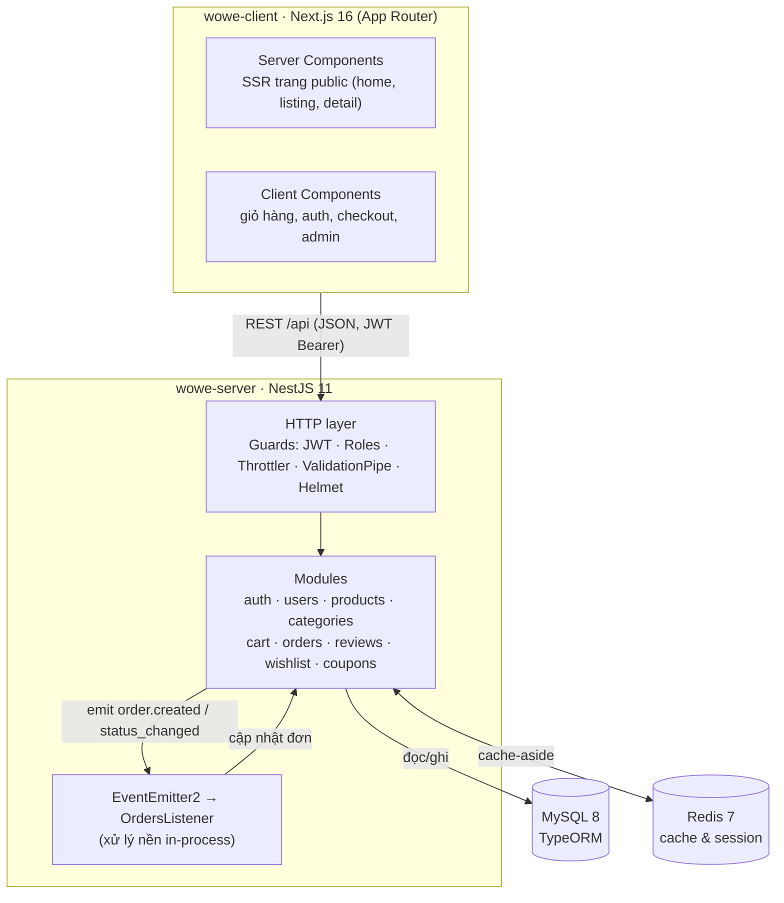
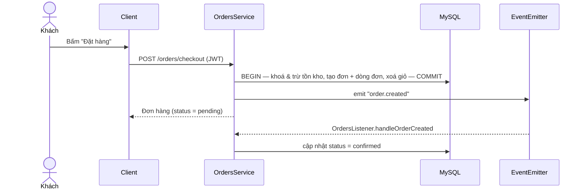

# 04 — Kiến trúc hệ thống

## 4.1 Sơ đồ kiến trúc



## 4.2 Luồng thanh toán (sequence)



## 4.3 Cấu trúc thư mục (server)

```
wowe-server/
├─ docker-compose.yml        # MySQL, Redis, Adminer (+ profile "app" chạy cả server)
├─ Dockerfile                # build image server (multi-stage)
├─ src/
│  ├─ main.ts                # bootstrap: prefix /api, Swagger, Helmet, CORS, ValidationPipe
│  ├─ app.module.ts          # TypeORM, EventEmitter, Throttler, guard toàn cục
│  ├─ config/                # cấu hình từ biến môi trường
│  ├─ common/                # enums, guards, decorators, dto dùng chung, transformer
│  ├─ entities/              # 13 entity TypeORM
│  ├─ redis/                 # RedisModule + RedisService (cache-aside)
│  ├─ database/              # data-source, seed, seed-data
│  └─ modules/               # auth, users, categories, products, cart,
│                            #   orders, reviews, wishlist, coupons, health
```

## 4.4 Cấu trúc thư mục (client)

```
wowe-client/
├─ app/                      # App Router
│  ├─ layout.tsx             # Header/Footer/Toaster, font, metadata
│  ├─ page.tsx               # Trang chủ (SSR)
│  ├─ products/              # listing + [slug] chi tiết (SSR)
│  ├─ cart, checkout         # client (cần đăng nhập)
│  ├─ orders, orders/[code]  # đơn hàng của khách
│  ├─ account, wishlist      # tài khoản, yêu thích
│  ├─ login, register        # xác thực
│  └─ admin/                 # quản trị đơn hàng (role admin)
├─ components/               # Header, ProductCard, AddToCart, ...
├─ hooks/ store/ lib/        # useCart; zustand auth+toast; api client, types, format
```

## 4.5 Quyết định kỹ thuật

| Quyết định | Lý do |
|-----------|-------|
| **TypeORM** thay Prisma | Tích hợp "native" với NestJS (repository injection, decorator entity), phù hợp phong cách DI. |
| **Event-emitter** thay RabbitMQ | Hệ thống là monolith; tác vụ nền (xác nhận đơn, "gửi email") không cần message broker riêng → giảm hạ tầng, đúng nguyên tắc "chỉ dùng cái thực sự cần". Có thể thay bằng broker khi tách microservice. |
| **Redis cache-aside** | Danh sách/chi tiết sản phẩm & cây danh mục đọc nhiều; cache giảm tải MySQL, tự invalidary khi admin sửa. |
| **Secure-by-default** | `JwtAuthGuard` toàn cục; route công khai đánh dấu `@Public()`; `@Roles(ADMIN)` cho quản trị. |
| **Snapshot đơn hàng** | Dòng đơn lưu tên/biến thể/giá/ảnh tại thời điểm mua → lịch sử đơn không đổi khi sản phẩm thay đổi. |
| **SSR + client islands (Next 16)** | Trang public render phía server (SEO, tải nhanh); phần cần token/tương tác dùng client component. `fetch` không cache mặc định (Next 16) nên trang dữ liệu là *dynamic*, build không gọi API. |
| **Cổng tuỳ biến** | Tránh xung đột trên VPS: MySQL host **3457**, Redis host **3456** (map về 3306/6379 trong container). |

## 4.6 Cache & invalidation
- Key `products:list:*` (TTL 60s), `products:slug:*` (TTL 120s), `categories:tree` (TTL 300s).
- Khi admin tạo/sửa/xoá sản phẩm hoặc cập nhật rating/sold → xoá theo pattern để làm mới.
